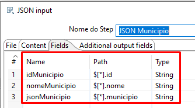
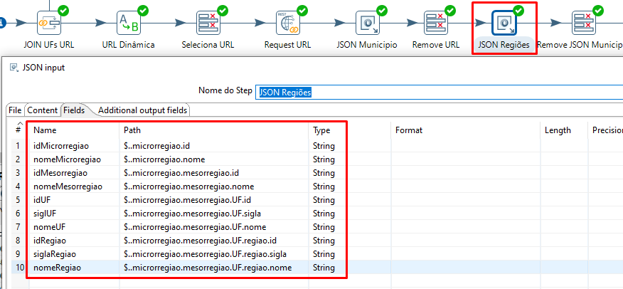

# PDI-Consumindo-Dados-IBGE

O objetivo desta transformação é realizar o consumo de dados que são fornecidos pela API do IBGE. O link se encontra <a href="https://servicodados.ibge.gov.br/api/docs/localidades" target="_blank">aqui</a>.

Ao observar a página, podem ser visualizados diversos conjuntos de dados em seu sumário tais como Distritos, Mesorregiões, Microrregiões, Municípios, Países, Regiões, dentre outros. Neste exemplo o consumo será realizado buscando os Distritos por UF. Na imagem abaixo, tem-se um detalhamento de como é o funcionamento da chamada para este conjunto de dados.

Observa-se que na imagem acima, os dados podem ser retornados utilizando um ID que representa a UF, porém, nos testes e implementação realizada, o funcionamento é o mesmo ao informar a sigla da UF desejada, como por exemplo "MG". Vale observar ainda, que se utilizado o caracter "|" (pipe) é possível obter o retorno dos dados de mais de uma UF na mesma chamada. 

Por fim, abaixo, tem-se um exemplo de como o array é retornado. 

Então mãos a massa, vamos elaborar um exemplo e detalha cada step da imagem abaixo. 

O pipeline para consumo criado, contempla dois steps de entrada sendo eles a URL e as UFs. Ambos foram gerados internamente no PDI, porém, poderiam ser buscados em um banco de dados ou arquivo que contivesse a URL e as UFs desejadas para a chamada e consumo dos dados. 

Para definicição das UFs foi utilizado o Data Grid, informando as UFs MG, GO, SC, BH e AM. 

Após isso, foi utilizado um Generate Rows informando a URL de consumo dos dados.

Os campos em vermelho da imagem acima, são os campos que foram configurados para a realidade deste cenário. 
Feito isso,  com os dados em mãos, a lógica elaborada foi agrupar as UFs MG, GO, SC, BH e AM transformando-as em " MG|GO|SC|BH|AM " conforme documentação da API. Porém, adiantando um tópico, ao utilizar  Pipe, o valor esperado na URL é " MG%7CGO%7CSC%7CBH%7CAM " isso basicamente acontece pois o pipe não é caractere válido, desse modo ele precisa ser convertido para um formato válido, neste caso o " %7C ". A explicação para isso está contida no trecho Todos os caracteres que precisam ser codificados para serem adicionados a URLs são codificados por meio do uso de um '%' e um valor hexadecimal de dois caracteres correspondente ao seu caractere UTF-8 presente neste <a href="https://developers.google.com/maps/url-encoding?hl=pt-br">link</a> 

Desse modo, foi utilizado o Group By conforme imagem abaixo: 

Após o agrupamento, foi realizando um join dos valores da URL e e UFs agrupada para que ambos os valores ficassem visíveis na mesma linha em colunas diferentes. Os campos destacados em vermelho, retratam respectivamente as configurações realizadas bem como o preview dos dados. 

Desse modo, o próximo passo, na lógica elaborada é substituir o trecho {URL} pelo valor concatenado, utilizando então o step Replace in string conforme imagem abaixo. 

Os campos em vermelho, novamente destacam as configurações realizadas e seguindo o fluxo do pipeline, foi utilizado um Select Values (não será aprofundado via imagens por se tratar de um step simples de ser utilizado) para selecionar apenas a coluna da URL criada que por fim foi submetida no step REST Cliente para realizar a chamada na API do IBGE. 

Com essa configuração, pode-se observar um preview dos dados. 

Desse modo, pode ser constatado que a API está retornando os dados. Sendo necessário agora fazer a leitura do Array retornado utilizando o step JSON Input. Com esse step, torna-se possível capturar dados de um array e deixá-los visíveis no formato colunar. As duas imagens abaixo, retratam as configurações realizadas. 

Foram abstraídos os dados de Ientificação e Nome do Município e posteriormente um Json do Município que possui informações complementares, que posteriormente será submetido em um segundo step de JSON Input.

Novamente, não aprofundando no step Select Values, pode-se observar na imagem acima que o JSON Regiões realiza a leitura dos dados da coluna JSON Município que possui as informações complementares informadas anteriormente. Desse modo, a seguir, tem-se mais um step select values para remover a coluna que possui valores em JSON e por fim, um step Dummy, para finalizar a transformação e exibir os dados coletados. 

A imagem abaixo encerra esta demonstração, exibindo os dados coletados. 

